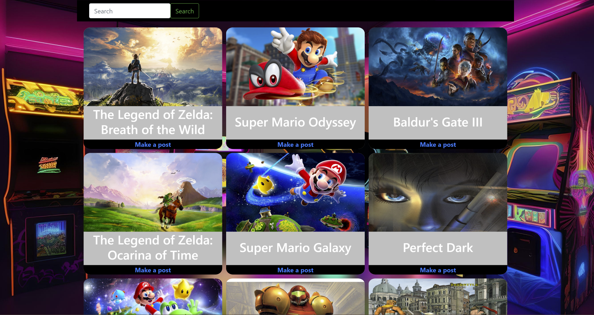

# gameU

## Description

gameU is a video game forum for gamers to post game reviews, rants, get advice, learn tips and tricks and brag about their in-game achievements. This project was created with 

## Usage

Upon page load, the user will see the landing page with the top 9 ranked video games on metacritic. Below the top game cards the user can scroll through the feed of previous posts. Before the user can interact with any existing posts, they will need to click on the "Login" button in the navigation area at the top of the page. After logging in or creating an account, the user can click on the "Make a post" button under a top game title of their choice to make a post about that game. Additionally, they can use the search bar at the top of the page to search for a different game to post about or comment on a previous post.

Here is the deployed app: [Check it out!](https://limitless-mountain-58094-a782c55b0be7.herokuapp.com/)

## Credits

Mitchell Wandall - [GitHub](https://github.com/MWandall)  
Shanna Brooks - [GitHub](https://github.com/shanna-not-shawna)  
Austin Tynes - [GitHub](https://github.com/austintynes)  

API:  
RAWG - [API](https://rawg.io/apidocs)  

## License

This project is covered under the MIT License.

## Badges

## How to Contribute

If you wish to contribute to this project, please reach out to the developers.
